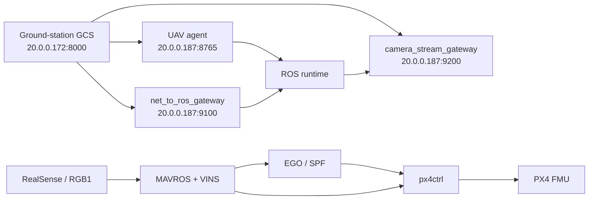

# GameUAV UAV-Side System Architecture

The canonical diagram sources live beside this file as Mermaid `.mmd` files.

## Top-Level Split

## Files

- `00_system_overview.mmd`
- `01_launch_bringup.mmd`
- `02_agent_comm_gateway.mmd`
- `03_perception_state_estimation.mmd`
- `04_planning_mission.mmd`
- `05_control_takeoff.mmd`

