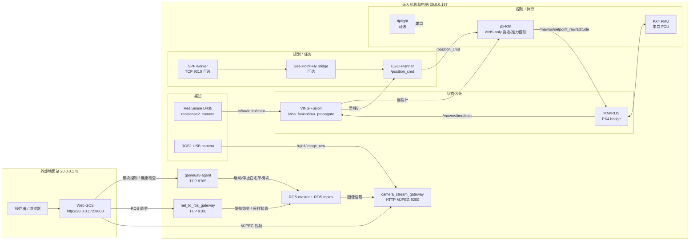
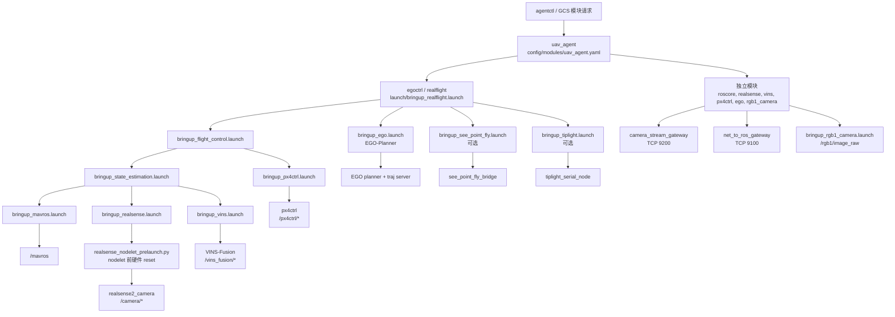
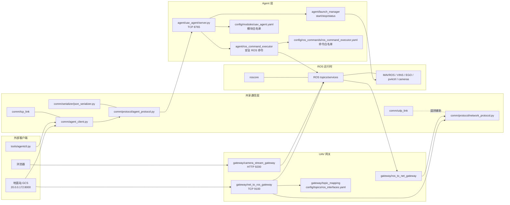
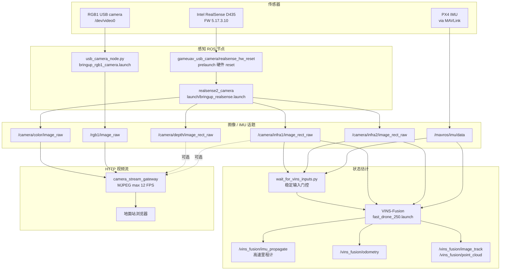
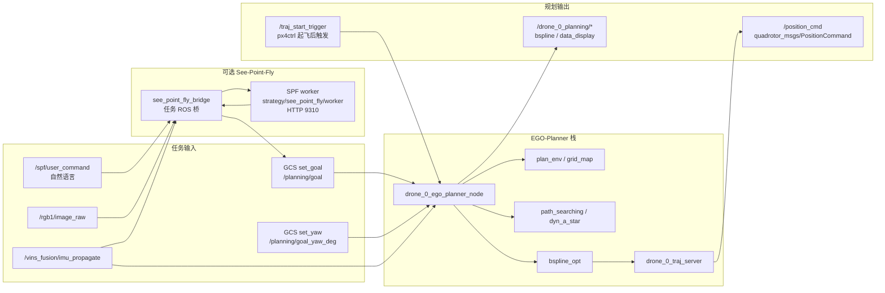
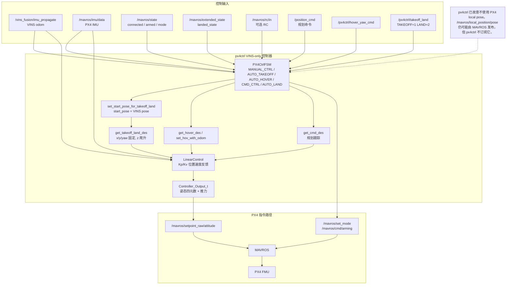

# GameUAV 无人机端系统架构说明

本文档描述 `/home/uav/Desktop/uav_project/gameuav` 仓库中的无人机端运行系统。地面站 GCS 运行在 `20.0.0.172`，这里只作为外部系统展示；本仓库不包含也不应恢复 UAV 本地 `gameuav-gcs.service`。

## 1. 系统总览



### 总体数据流

- 地面站通过 `gameuav-agent:8765` 管理 UAV 侧模块。
- 地面站通过 `net_to_ros_gateway:9100` 下发 ROS 指令。
- 地面站通过 `camera_stream_gateway:9200` 查看 UAV 侧视频流。
- RealSense 和 PX4 IMU 进入 VINS，输出 `/vins_fusion/imu_propagate`。
- `px4ctrl` 使用 VINS 里程计做闭环控制，输出 `/mavros/setpoint_raw/attitude`。
- MAVROS 将姿态/推力 setpoint 发给 PX4 FMU。

## 2. 启动链路



### 常用启动入口

- `egoctrl`: 一键启动 MAVROS、RealSense、VINS、EGO、px4ctrl。
- `flight_control`: 启动状态估计和 px4ctrl，不含 EGO。
- `state_estimation`: MAVROS、RealSense、VINS 组合。
- `camera_stream_gateway`: UAV 本地 MJPEG 视频服务。

## 3. Agent、通信与网关



### 说明

- `config/modules/uav_agent.yaml` 限定 agent 可以启动哪些模块。
- `config/ros_commands/ros_command_executor.yaml` 限定 GCS 能执行哪些 ROS 命令。
- `camera_stream_gateway` 只负责把 ROS 图像话题转成 HTTP MJPEG。
- 当前 UAV 端不运行 GCS Web 后端。

## 4. 感知与状态估计



### 当前感知关键点

- RealSense color 默认启用。
- RealSense nodelet 前有预 reset，避免内部 `initial_reset` 引起 udev race。
- MJPEG 网关限制单客户端最新流和帧率，避免快速切换视频导致连接堆积。

## 5. 规划与任务



### 说明

- EGO-Planner 输出 `/position_cmd`，由 `px4ctrl` 跟踪。
- See-Point-Fly 是可选任务层，默认不随 `egoctrl` 启动。
- `/traj_start_trigger` 由 `px4ctrl` 在起飞后触发，用于允许后续用户命令或规划。

## 6. 控制与 VINS-only 起降



### VINS-only 垂直起飞控制逻辑

起飞触发来自：

```text
/px4ctrl/takeoff_land
takeoff_land_cmd = 1
```

`px4ctrl` 进入 `AUTO_TAKEOFF` 后：

```text
start_pose = 当前 VINS pose
des.x = start_x
des.y = start_y
des.z = start_z + takeoff_speed * t
des.yaw = start_yaw
```

控制器使用：

```text
des_acc = des.a + Kv * (des.v - odom.v) + Kp * (des.p - odom.p) + gravity
```

因此起飞期间如果 XY 发生漂移，`des.p - odom.p` 的 XY 误差会产生水平回拉加速度，再转换成 roll/pitch 姿态修正。

当前已调过的 XY 位置增益：

```yaml
Kp0: 2.0
Kp1: 2.0
Kv0: 1.5
Kv1: 1.5
```

## 7. 关键端口与话题

| 类别 | 地址或话题 | 说明 |
|---|---|---|
| UAV agent | `20.0.0.187:8765` | 模块管理 |
| net-to-ROS gateway | `20.0.0.187:9100` | 网络命令到 ROS |
| camera stream gateway | `20.0.0.187:9200` | HTTP MJPEG |
| Ground GCS | `20.0.0.172:8000` | 地面站 Web |
| RealSense IR | `/camera/infra1/image_rect_raw`, `/camera/infra2/image_rect_raw` | VINS 输入 |
| RealSense color | `/camera/color/image_raw` | 视频流/视觉 |
| PX4 IMU | `/mavros/imu/data` | VINS 与控制输入 |
| VINS odom | `/vins_fusion/imu_propagate` | px4ctrl 主定位输入 |
| Planner command | `/position_cmd` | EGO 到 px4ctrl |
| Control output | `/mavros/setpoint_raw/attitude` | px4ctrl 到 PX4 |
| Takeoff/land | `/px4ctrl/takeoff_land` | TAKEOFF=1, LAND=2 |

## 8. 相关图源文件

同目录下还保留了拆分后的 Mermaid 源文件：

- `00_system_overview.mmd`
- `01_launch_bringup.mmd`
- `02_agent_comm_gateway.mmd`
- `03_perception_state_estimation.mmd`
- `04_planning_mission.mmd`
- `05_control_takeoff.mmd`

